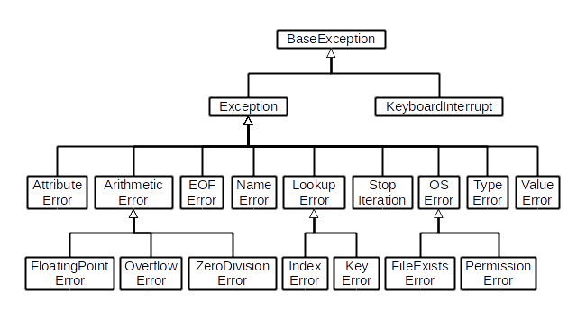

# Description: Exception Handling in Python

### Exceptions in Python
* Python has many built-in exceptions which forces a program to output an error when something in it goes wrong.
* When these exceptions occur, it causes the current process to stop and passes it to the calling process until it is 
  handled. If not handled, the program will crash.
* Example: If function A calls function B which in turn calls function C and an exception occurs in function C. If 
  it is not handled in C, the exception passes to B and finally to A. If never handled, an error message is spit out and 
  our program come to a sudden, unexpected halt.

### Python Built-in Exceptions
| Exception             | Cause of Error                                                                                |
|-----------------------|-----------------------------------------------------------------------------------------------|
| AssertionError        | Raised when assert statement fails.                                                           |
| AttributeError        | Raised when attribute assignment or reference fails.                                          |
| EOFError              | Raised when the input() functions hits end-of-file condition.                                 |
| FloatingPointError    | Raised when a floating point operation fails.                                                 |
| GeneratorExit         | Raise when a generator's close() method is called.                                            |
| ImportError           | Raised when the imported module is not found.                                                 |
| IndexError            | Raised when index of a sequence is out of range.                                              |
| KeyError              | Raised when a key is not found in a dictionary.                                               |
| KeyboardInterrupt     | Raised when the user hits interrupt key (Ctrl+c or delete).                                   |
| MemoryError           | Raised when an operation runs out of memory.                                                  |
| NameError             | Raised when a variable is not found in local or global scope.                                 |
| NotImplementedError   | Raised by abstract methods.                                                                   |
| OSError               | Raised when system operation causes system related error.                                     |
| OverflowError         | Raised when result of an arithmetic operation is too large to be represented.                 |
| ReferenceError        | Raised when a weak reference proxy is used to access a garbage collected referent.            |
| RuntimeError          | Raised when an error does not fall under any other category.                                  |
| StopIteration         | Raised by next() function to indicate that there is no further item to be returned by iterator.|
| SyntaxError           | Raised by parser when syntax error is encountered.                                            |
| IndentationError      | Raised when there is incorrect indentation.                                                   |
| TabError              | Raised when indentation consists of inconsistent tabs and spaces.                             |
| SystemError           | Raised when interpreter detects internal error.                                               |
| SystemExit            | Raised by sys.exit() function.                                                                |
| TypeError             | Raised when a function or operation is applied to an object of incorrect type.                |
| UnboundLocalError     | Raised when a reference is made to a local variable in a function or method, but no value has been bound to that variable.|
| UnicodeError          | Raised when a Unicode-related encoding or decoding error occurs.                              |
| UnicodeEncodeError    | Raised when a Unicode-related error occurs during encoding.                                   |
| UnicodeDecodeError    | Raised when a Unicode-related error occurs during decoding.                                   |
| UnicodeTranslateError | Raised when a Unicode-related error occurs during translating.                                |
| ValueError            | Raised when a function gets argument of correct type but improper value.                      |
| ZeroDivisionError     | Raised when second operand of division or modulo operation is zero.                           |

### Python Exception Hierarchy

