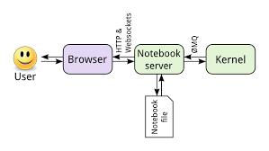

# Description: Jupyter Notebooks

### Jupyter Notebook
* A "notebook" or "notebook documents" denote documents that contain both code and rich text elements, such as figures, 
  links, equations, etc.
* These notebooks are an ideal place to bring together an analysis description, and its results, as well as, execute
  the data analysis code in real time.
* Jupyter Notebook is a client-server implementation of one such notebook document system.
* Jupyter Notebook App allows us to edit and run notebooks via a web browser.
* Jupyter is a loose acronym for Julia, Python, and R. These programming languages were the first target languages of 
  the Jupyter application, but now the notebook technology supports many other languages.  
* A Jupyter Notebook can be converted to a number of open standard output formats, namely, HTML, presentation slides, 
  LaTeX, PDF, ReStructuredText, Markdown, Python through "Download As" in the web interface, via the nbconvert library 
  or "jupyter nbconvert" command line interface in a shell.

### Components of Jupyter Notebook
1. Jupyter Kernels: A kernel is a program that runs and introspects the user’s code. The Jupyter Notebook App has a kernel for  
   Python code, but there are also kernels available for other programming languages.
2. Jupyter Dashboard: The dashboard of the application shows the notebook documents that are currently available. Dashboard can  
   also be used to manage the kernels, like list various kernels, shutting down kernels etc.
   
   
3. JupyterHub: JupyterHub is a multi-user server for Jupyter Notebooks. It is designed to support many users by 
   spawning, managing, and proxying many singular Jupyter Notebook servers.
4. JupyterLab: JupyterLab is the next-generation user interface for Project Jupyter. 

### History of Jupyter Notebook
* 2001  : Fernando Pérez starts developing IPython.
* 2005  : Robert Kern and Fernando Pérez attempted building a notebook system. Unfortunately, the prototype had never 
          become fully usable. 
* 2007  : IPython team had kept on workin and they formulated another attempt at implementing a notebook-type system.
* 2010  : There was a prototype of a web notebook.
* 2011  : This prototype was incorporated, and released with 0.12 on December 21, 2011.
* 2014  : Project Jupyter started as a spin-off project from IPython.
* 2015  : JupyterLab was formed. The next generation of Jupyter Notebooks has been introduced to the community as 
          JupyterLab. IPython is now the name of the Python backend, which is also known as the kernel.
* 2015  : GitHub and the Jupyter Project announced native rendering of Jupyter notebooks file format (.ipynb files) on 
          the GitHub platform

### Jupyter Notebook Installation
```
# Install jupyter as python package
pip install jupyter

# Run Jupyter Notebooks in a docker container
docker run --rm -it -p 8888:8888 -v "$(pwd):/notebooks" jupyter/notebook
```

### Run Jupyter Notebook
```
# Start server from the desired directory
cd /tmp/notebook
 
# Start the server
jupyter notebook

# Visit the following URL from a browser if it is not automatically opened.
http://localhost:8888

# Create notebook and execute the code
# See NEXT section below.

# Use Ctrl + C to stop the server.
```

### Create a Notebook and Execute the Code
* Create a notebook: File - New Notebook - Python 3
* Give a name to the notebook as 'MyNotebook'. 
* Type the following code in 4 different cells and click on `Run`.
```
# The Factorial

from math import factorial
print(factorial(5))

# The Fibonaci Series

i = 1
number = 10
while(i < number):
    if(i <= 1):
        a = 1
        b = 1
    else:
        a, b = b, a + b
    print(a)
    i = i + 1
```

### Export Notebook in Different Formats
* Notebook  : `Menu - File - Download as - Notebook (.ipynb)`.
* HTML      : `Menu - File - Download as - HTML (.html)`.
* PDF       : `Menu - File - Download as - LaTex (.tex)`.
* Latex     : `Menu - File - Download as - PDF via LaTex (.pdf)`.

### TODO
* Explore the Jupyter Dashboard.
* Explore execution from command line.
* Install and experiment with LaTeX and R kernel and mix all the codes together.
* Explore making Jupyter Notebook Magical.
