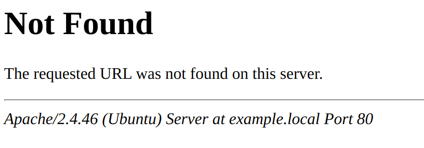

# Description: Apache Hardening Document

### Understand Apache Deployment
* Understand everything that is configured in Apache conf.
* Understand each of the modules that are enabled/loaded.
```
# Get a list of all loaded modules.
apachectl -t -D DUMP_MODULES
```
* Understand the deployment of apache.

### Remove All Unused Modules
* Info
    - TODO
* Test
    - `grep LoadModule /path/to/apache/conf/httpd.conf`
* Hardening
    - The modules like mod_imap, mod_include, mod_info, mod_userdir, mod_autoindex are rarely used. To disable a 
      particular module, add a '#' at the beginning of that line in apache.conf and restart the service.

### Redirect `http://www.example.local` to `http://example.local`
* Info
    - TODO
* Test
    - TODO
* Hardening
    - TODO
    ```
    Write here
    ```

### Forbid Hotlinking for media files to conserve bandwidth.
* Info
    - TODO
* Test
    - TODO
* Hardening
    - TODO
    ```
    Write here
    ```

### Disable .htaccess
* Info
    - Check virtualhost
    - Check apache.conf
* Test
    - TODO
* Hardening
    - TODO
    ```
    Write here
    ```

### Disable Serving of `.htaccess` and `.htpasswd` Files
* Info
    - TODO
* Test
    - TODO
* Hardening
    - TODO
    ```
    Write here
    ```

### Disable Server Signature
* Info
    - TODO
* Test
    - Open a page in a browser that does not exist.
    
    
    - Use `curl -I example.local` to get HTTP Header and look for `Server` in the HTTP Response.
* Hardening
    - Disable Server Signature by editing apache2.conf and adding the following.
    ```
    ServerTokens Prod
    ServerSignature Off
    
    # Restart Apache after this.
    ```

### Disable Directory Listing
* Info
    - TODO
* Test
    - TODO
* Hardening
    - Add -Indexes instead of +Indexes or Indexes in virtual host entry in the site conf file.
    ```
    <Directory /path/to/example.com/www>
        Options -Indexes
    </Directory>
    ```
    - Alternatively add in the apache.conf file instead of a particular directory
    ```
    Options -Includes
    Options -ExecCGI
    ```

### Disable FollowSymLinks
* Info
    - TODO
* Test
    - TODO
* Hardening
    - Add -FollowSymLinks instead of +FollowSymLinks or FollowSymLinks in virtual host entry in the site conf file.
    ```
    <Directory /path/to/example.com/www>
        Options -FollowSymLinks
    </Directory>
    ```

### Turn off Server Side Includes and CGI Execution
* Info
    - TODO
* Test
    - TODO
* Hardening
    - Add -ExecCGI instead of +ExecCGI or ExecCGI in virtual host entry in the site conf file.
    ```
    Options -ExecCGI
    ```

### Disable Etag
* Info
    - It allows remote attackers to obtain sensitive information like inode number, multipart MIME boundary, and child 
      process through Etag header.
* Test
    - curl -I `example.local` and look for ETag header in HTTP Response
* Hardening
    - Add the following to apache.conf file 
    ```
    FileETag None
    ```

### Run Apache from a non-privileged account
* Info
    - TODO
    - In Ubuntu it is already done by default
* Test
    - TODO
* Hardening
    - TODO
    ```
    Write here
    ```

### Protect binary and configuration directory permission
* Info
    - TODO
* Test
    - TODO
* Hardening
    - TODO
    ```
    Write here
    ```

### System Settings Protection
* Info
    - TODO
* Test
    - TODO
* Hardening
    - TODO
    ```
    Write here
    ```

### HTTP Request Methods
* Info
    - TODO
* Test
    - TODO
* Hardening
    - TODO
    ```
    <LimitExcept GET POST HEAD>
    deny from all
    </LimitExcept>
    ```

### Disable Trace HTTP Request
* Info
    - TODO
* Test
    - TODO
* Hardening
    - TODO
    ```
    TraceEnable off
    ```

### Set cookie with HttpOnly and Secure flag
* Info
    - TODO
* Test
    - TODO
* Hardening
    - TODO
    ```
    Header edit Set-Cookie ^(.*)$ $1;HttpOnly;Secure
    ```

### Clickjacking Attack
* Info
    - TODO
* Test
    - TODO
* Hardening
    - TODO
    ```
    Header always append X-Frame-Options SAMEORIGIN
    ```

### Server Side Include
* Info
    - TODO
* Test
    - TODO
* Hardening
    - TODO
    ```
    <Directory /path/to/example.com/www>
        Options –Indexes -Includes
        Order allow,deny
        Allow from all
    </Directory>
    ```

### X-XSS Protection
* Info
    - TODO
* Test
    - TODO
* Hardening
    - TODO
    ```
    Header set X-XSS-Protection "1; mode=block"
    ```

### Disable HTTP 1.0 Protocol
* Info
    - TODO
* Test
    - TODO
* Hardening
    - TODO

    ```
    RewriteEngine On
    RewriteCond %{THE_REQUEST} !HTTP/1.1$
    RewriteRule .* - [F]
    ```

### Timeout value configuration
* Info
    - TODO
* Test
    - TODO
* Hardening
    - TODO
    ```
    Timeout 60
    ```

### Limit Request Size
```
<Directory "/path/to/example.com/www">
    LimitRequestBody 10485760
</Directory>
```
### Keep Apache Updated
* Info
    - TODO
* Test
    - TODO
* Hardening
    - Check for apache version and check for vulnerability online and suggest fix.
    ```
    Write here
    ```

### Use Allow and Deny to Restrict access to Directories
* Info
    - TODO
* Test
    - TODO
* Hardening
    - TODO
    ```
    <Directory />
       Options None
       Order deny,allow
       Deny from all
    </Directory>
    ```

### Enable Apache Logging
* Info
    - TODO
* Test
    - TODO
* Hardening
    - TODO
    ```
    Write here
    ```

## SSL
### Use 2048 bit SSL Key
* Info
    - TODO
* Test
    - TODO
* Hardening
    - TODO
    ```
    openssl req -out geekflare.csr -newkey rsa:2048 -nodes -keyout geekflare.key
    ```

### SSL Cipher
* Info
    - TODO
* Test
    - TODO
* Hardening
    - TODO
    ```
    SSLCipherSuite HIGH:!MEDIUM:!aNULL:!MD5:!RC4
    ```

### Disable SSL v2 & v3
* Info
    - TODO
* Test
    - TODO
* Hardening
    - Edit  httpd-ssl.conf
    ```
    SSLProtocol –ALL +TLSv1.2
    ```

## Secure Apache using mod_security and mod_evasive Modules
* Info
    - This is a module in itself
* Test
    - TODO
* Hardening
    - TODO
    ```
    Write here
    ```

### Protect DDOS attacks and Hardening
* Info
    - TODO
* Test
    - TODO
* Hardening
    - TODO
    ```
    Write here
    ```

### Write here
* Info
    - TODO
* Test
    - TODO
* Hardening
    - TODO
    ```
    Write here
    ```
